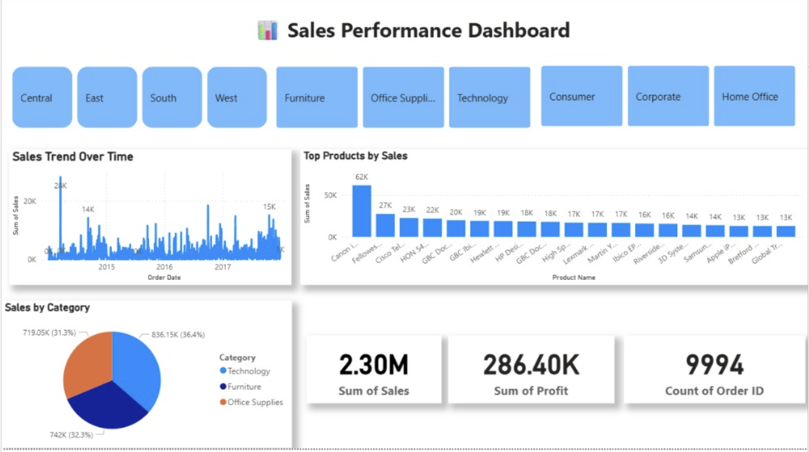

# 📊 Business Sales Performance Analytics
### Data Science & Analytics — Task 1 (2026) | Future Interns

---

## 📌 Objective

The goal of this task is to analyze real-world business sales data and build a professional, client-ready dashboard that answers critical business questions:

- Which products generate the most revenue?
- How do sales change over time?
- Which categories are most profitable?
- Where should the business focus to grow faster?

---

## 🛠️ Tools & Technologies

| Tool | Purpose |
|---|---|
| **Power BI Desktop** | Dashboard creation & interactive visualization |
| **Superstore Sales Dataset** | Business sales data (used as-is) |

---

## 📂 Dataset

- **Name:** Superstore Sales Dataset
- **Source:** [Kaggle — Superstore Dataset](https://www.kaggle.com/datasets/vivek468/superstore-dataset-final)
- **Scope:** Orders, sales, profit, product categories, sub-categories, and regions
- **Note:** Dataset was used as-is — no data cleaning or transformation was performed

---

## 📊 Dashboard Overview

The interactive Power BI dashboard answers key business questions through the following visuals:

### 🔘 Filter Slicers
Dynamic filters to slice data by:
- **Region** — Central, East, South, West
- **Category** — Furniture, Office Supplies, Technology
- **Segment** — Consumer, Corporate, Home Office

### 📈 Sales Trend Over Time
A time-series chart showing monthly sales performance from **2014 to 2017**, helping identify seasonal patterns and growth periods.

### 🏆 Top Products by Sales
A bar chart ranking the **top products by revenue**, with **Canon imageCLASS** leading at **62K** in total sales.

### 🥧 Sales by Category
A pie chart breaking down total revenue across three product categories:
- 🔵 **Technology** — 836.15K (36.4%)
- 🔵 **Furniture** — 742K (32.3%)
- 🟠 **Office Supplies** — 719.05K (31.3%)

### 💰 KPI Summary Cards

| Metric | Value |
|---|---|
| Sum of Sales | **2.30M** |
| Sum of Profit | **286.40K** |
| Count of Orders | **9,994** |

---

## 💡 Key Business Insights

- 📦 **Technology** leads all categories, contributing **36.4%** of total revenue — the business should continue investing in this segment
- 🏷️ **Canon imageCLASS** is the single highest-grossing product at **62K** in sales
- 📅 **Sales peak in late 2016–2017**, showing strong seasonal spikes — useful for inventory and campaign planning
- 🌍 All four regions are active, offering opportunity for targeted regional strategies
- 💸 With **2.30M in total sales** and **286.40K in profit**, the overall profit margin is approximately **12.5%**

---

## 📸 Dashboard Preview

---

## 🚀 Outcome

This project demonstrates how raw business data can be transformed into actionable intelligence using **Power BI** — without any coding. The dashboard is designed to be shown directly to:

- A business owner tracking performance
- A startup founder evaluating product strategy
- An analytics client seeking data-driven decisions

Key skills demonstrated through this task:
- Business KPI analysis
- Sales trend identification
- Category and product performance reporting
- Dashboard design and data storytelling

---

## 📂 Project Files

| File | Description |
|---|---|
| `Sales_Dashboard.pbix` | Power BI dashboard file |
| `Dashboard.png` | Dashboard preview screenshot |

---

## 🔗 Internship

This project was completed as part of the **Future Interns — Data Science & Analytics Internship Program (2026)**.

👉 [Future Interns on LinkedIn](https://www.linkedin.com/company/future-interns/)

---

## 📢 Conclusion

This task showcases how Power BI can turn raw sales data into clear, client-ready business insights — no coding required. The Superstore dataset provided a solid foundation for practicing real-world analytics and data storytelling.

---

⭐ If you found this useful, feel free to star the repo and share your feedback!
